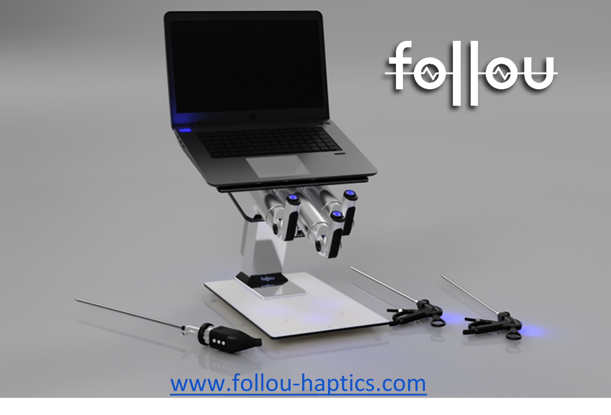

# SOFA plugin for Haptic Avatar device

## Description

Haptic Avatar is a haptic device from [Follou Haptics](https://www.follou-haptics.com/) for minimally invasive surgical training, e.g. laparoscopy, arthroscopy and thoracoscopy. 
It has four degrees of freedom, all with force feedback, and a form factor that enables multiple and adjustable portal placement suitable for both individual and team training.

### Features
https://github.com/
- Compatible with SOFA v21.12, v22.06 on Windows only. 
- Support multiple tools
- Multiple demo scenes for 1 and 2 devices in XML and python

Modelized in SOFA using Articulated System Mapping mechanism

## Installation
This plugin should be added as an external plugin of SOFA using the CMAKE_EXTERNAL_DIRECTORIES CMake variable of SOFA. 
See SOFA documentation for more information

## License
This work is dual-licensed under either [LGPL](https://github.com/sofa-framework/SofaHapticAvatar/blob/main/LICENSE.md)

